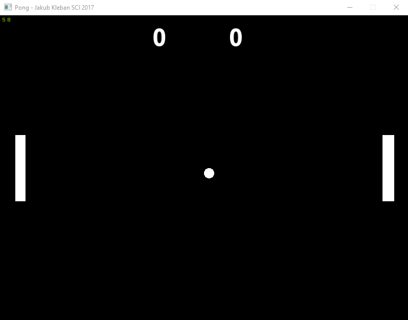
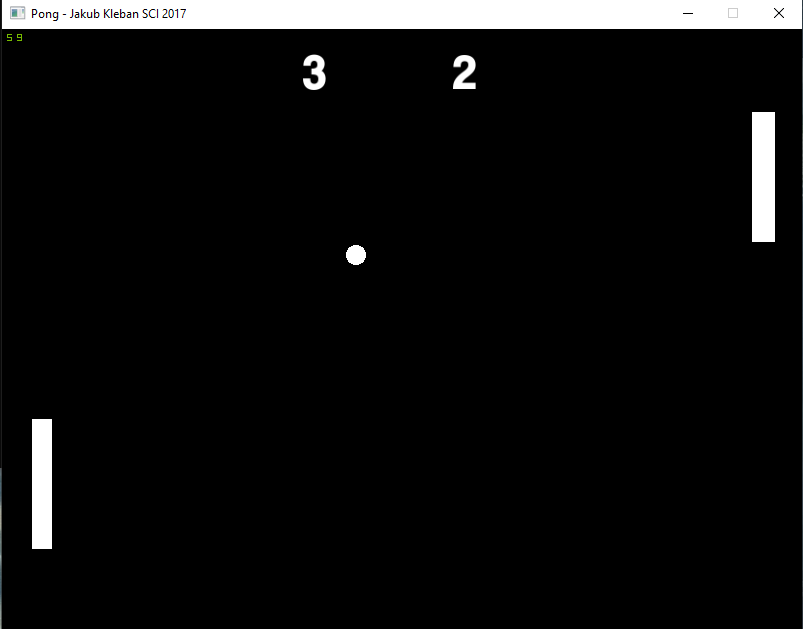

PONG in C++ SFML
===================================
A fun version of [PONG](https://en.wikipedia.org/wiki/Pong) created for education purposes.

# Visuals

---

# Instalation:
<https://www.sfml-dev.org/tutorials/2.5/start-vc.php>

# Contributing

Pull requests are welcome. For major changes, please open an issue first to discuss what you would like to change.

Please make sure to update tests as appropriate.

# Author

[Jakub Kleban](https://github.com/klebann)

# License
[GPL](https://www.gnu.org/licenses/gpl-3.0.en.html)